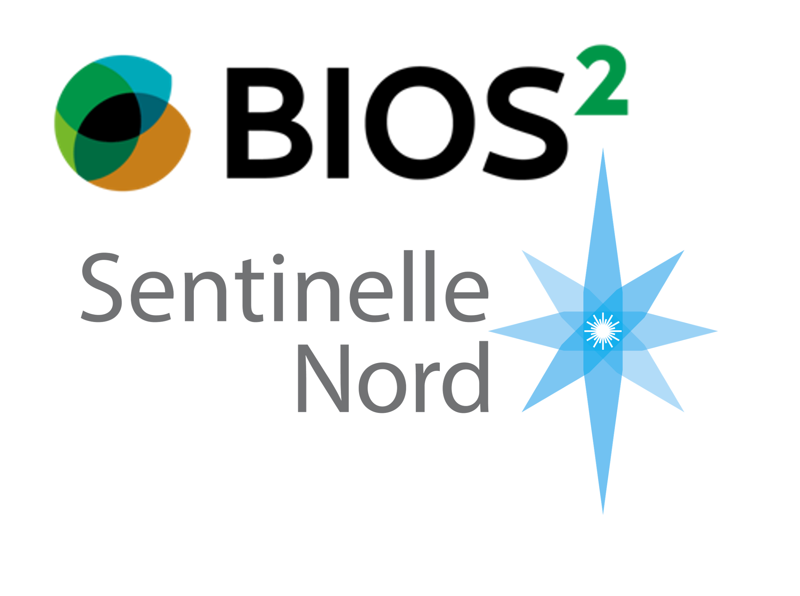

# **Computational Ecology Summer School 2023**

## **Behavioural Ecology Work Package**

Code repository for the behavioural ecology work package presented to participants of the BIOS2 - Sentinelle Nord - Computational Ecology Summer School held at Val-Morin, Québec, Canada.

In this repository you will find :

- the .html documents presented during the R coding sessions
- the .rmd documents used to generate the .html documents
- the .pptx files used for the lectures in the **lecture_docs** folder
- the relevant literature in the **reading material.zip** folder

You can download the full repository as a .zip folder and work with it directly in your computer.

*Note : add link to the model outputs (i.e. .rds files)*
